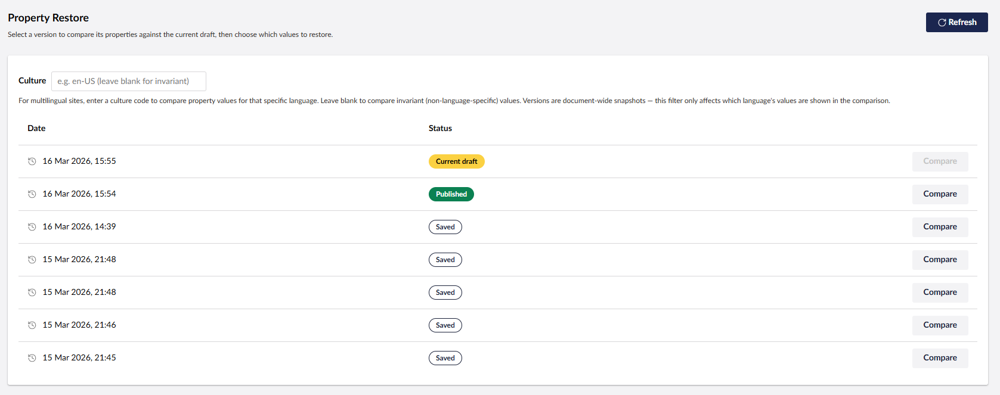
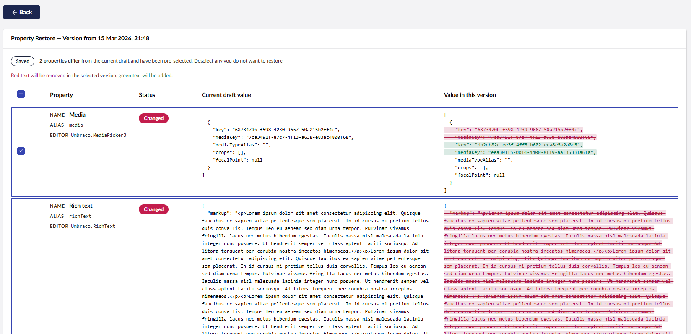

# uRestore

Selectively restore individual property values from any saved content version — directly inside the Umbraco backoffice.

uRestore adds a **Property Restore** tab to every content node workspace. Editors can browse version history, compare any saved version against the current draft property-by-property, and choose exactly which values to restore — without affecting the properties they want to keep.



## Requirements

- Umbraco 17+
- .NET 10+

## Installation

```bash
dotnet add package Umbraco.Community.uRestore
```

No configuration is required. After installing the package and restarting your site, a **Property Restore** tab will appear in the content editor for all document types.

## Usage

1. Open any content node in the backoffice
2. Click the **Property Restore** tab
3. Click **Compare** on any version to see a property-by-property diff
4. Select the properties you want to restore and click **Restore selected**
5. Choose to save as draft or save and publish from the confirmation dialog



## Contributing

Contributions are welcome! Please raise an issue or pull request on [GitHub](https://github.com/Jordan-Smith-Dev/Umbraco.Community.uRestore).
